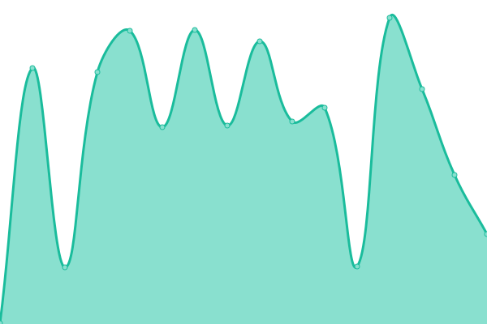
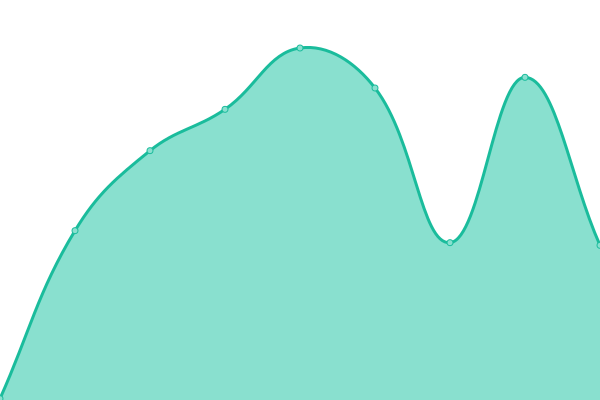

# [📈 Live Status](https://lordoshko.github.io/MySitesUptime): <!--live status--> **🟩 All systems operational**

This repository contains the open-source uptime monitor and status page for [lordoshko](https://lordoshko.github.io/MySitesUptime), powered by [Upptime](https://github.com/upptime/upptime).

With [Upptime](https://upptime.js.org), you can get your own unlimited and free uptime monitor and status page, powered entirely by a GitHub repository. We use [Issues](https://github.com/lordoshko/MySitesUptime/issues) as incident reports, [Actions](https://github.com/lordoshko/MySitesUptime/actions) as uptime monitors, and [Pages](https://lordoshko.github.io/MySitesUptime) for the status page.

<!--start: status pages-->
<!-- This summary is generated by Upptime (https://github.com/upptime/upptime) -->
<!-- Do not edit this manually, your changes will be overwritten -->
<!-- prettier-ignore -->
| URL | Status | History | Response Time | Uptime |
| --- | ------ | ------- | ------------- | ------ |
|  [Inflatus Lab Server](https://server.inflatuslab.com) | 🟩 Up | [inflatus-lab-server.yml](https://github.com/LordOshko/MySitesUptime/commits/HEAD/history/inflatus-lab-server.yml) | 

 261ms
     
 | 

<a href="https://lordoshko.github.io/MySitesUptime/history/inflatus-lab-server">100.00%</a>
    

|  [Guide Your Life](https://guideyourlife.pro) | 🟩 Up | [guide-your-life.yml](https://github.com/LordOshko/MySitesUptime/commits/HEAD/history/guide-your-life.yml) | 

 227ms
     
 | 

<a href="https://lordoshko.github.io/MySitesUptime/history/guide-your-life">100.00%</a>
    

|  [Inbox Impact](https://inboximpact.lol) | 🟩 Up | [inbox-impact.yml](https://github.com/LordOshko/MySitesUptime/commits/HEAD/history/inbox-impact.yml) | 

 508ms
     
 | 

<a href="https://lordoshko.github.io/MySitesUptime/history/inbox-impact">100.00%</a>
    

|  [Inflatus Labs](https://inflatuslabs.com) | 🟩 Up | [inflatus-labs.yml](https://github.com/LordOshko/MySitesUptime/commits/HEAD/history/inflatus-labs.yml) | 

 207ms
     
 | 

<a href="https://lordoshko.github.io/MySitesUptime/history/inflatus-labs">100.00%</a>
    

|  [Inflatus Lab Server](https://server.inflatuslab.com) | 🟩 Up | [inflatus-lab-server.yml](https://github.com/LordOshko/MySitesUptime/commits/HEAD/history/inflatus-lab-server.yml) | 

 261ms
     
 | 

<a href="https://lordoshko.github.io/MySitesUptime/history/inflatus-lab-server">100.00%</a>
    

|  [Mail Magic Hub](https://mailmagichub.lol) | 🟩 Up | [mail-magic-hub.yml](https://github.com/LordOshko/MySitesUptime/commits/HEAD/history/mail-magic-hub.yml) | 

 253ms
     
 | 

<a href="https://lordoshko.github.io/MySitesUptime/history/mail-magic-hub">100.00%</a>
    

|  [Mail Master Mind](https://mailmastermind.lol) | 🟩 Up | [mail-master-mind.yml](https://github.com/LordOshko/MySitesUptime/commits/HEAD/history/mail-master-mind.yml) | 

 181ms
     
 | 

<a href="https://lordoshko.github.io/MySitesUptime/history/mail-master-mind">100.00%</a>
    

|  [Mind Mastery Hub](https://mindmasteryhub.pro) | 🟩 Up | [mind-mastery-hub.yml](https://github.com/LordOshko/MySitesUptime/commits/HEAD/history/mind-mastery-hub.yml) | 

 226ms
     
 | 

<a href="https://lordoshko.github.io/MySitesUptime/history/mind-mastery-hub">100.00%</a>
    

|  [Email Empire](https://emailempire.lol) | 🟩 Up | [email-empire.yml](https://github.com/LordOshko/MySitesUptime/commits/HEAD/history/email-empire.yml) | 

 401ms
     
 | 

<a href="https://lordoshko.github.io/MySitesUptime/history/email-empire">100.00%</a>
    

<!--end: status pages-->

[**Visit our status website →**](https://lordoshko.github.io/MySitesUptime)

## 📄 License

- Powered by: [Upptime](https://github.com/upptime/upptime)
- Code: [MIT](./LICENSE) © [Anand Chowdhary](https://anandchowdhary.com), supported by [Pabio](https://pabio.com)
- Data in the `./history` directory: [Open Database License](https://opendatacommons.org/licenses/odbl/1-0/)
